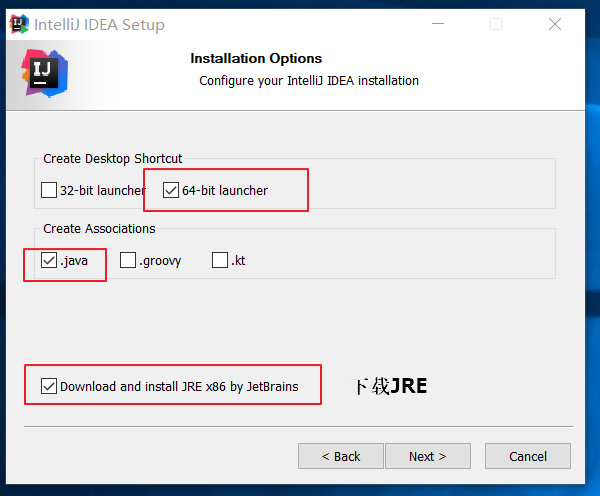
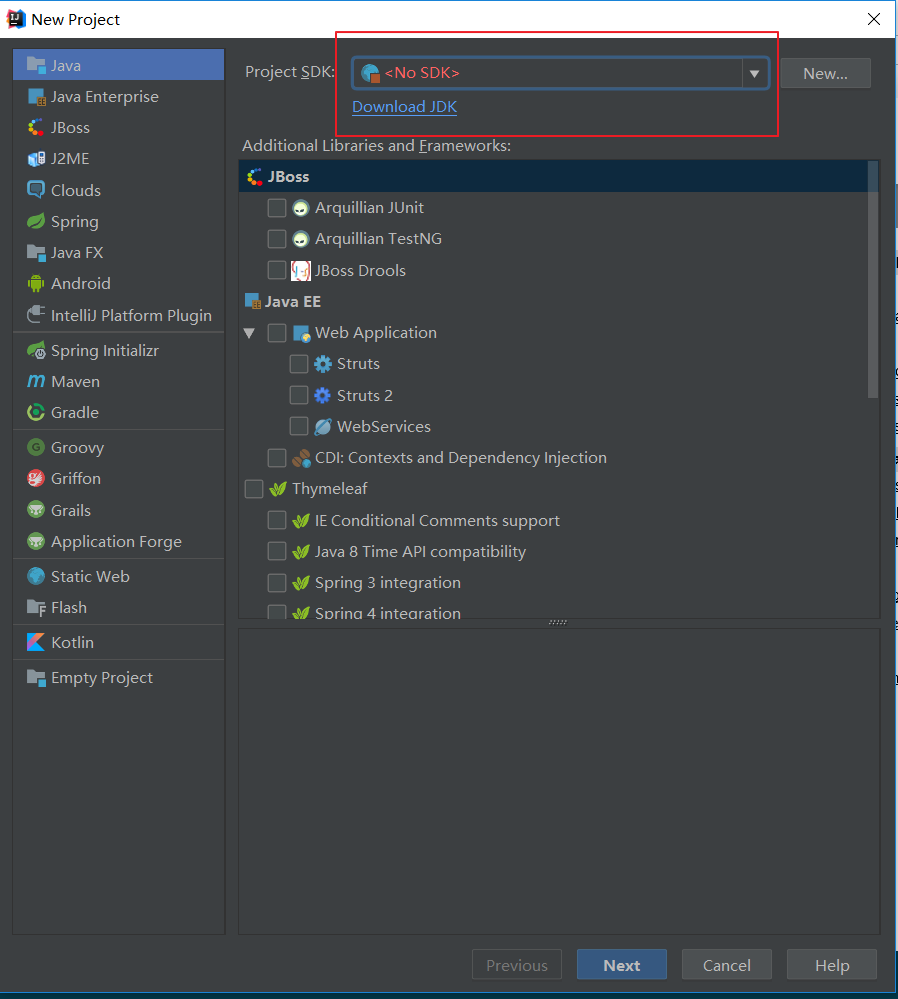
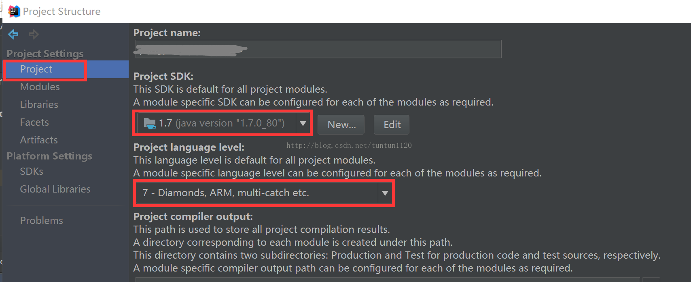
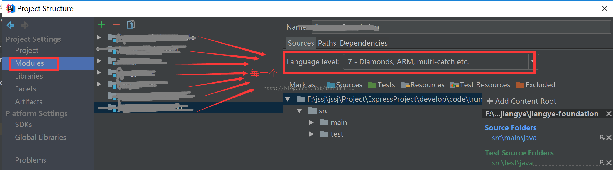
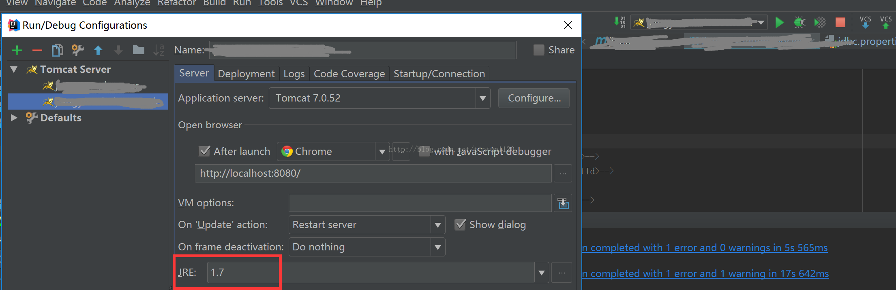

[TOC]

## 教程+文章
* 视频
    - [慕课网IDEA使用技巧](https://www.imooc.com/video/16226)
*

## 安装
1.安装时选择下载JRE  
 
2.下载JDK安装  
 

## jDK版本错误时
更改以下3个位置的JDK配置 <\br><\br>
 <\br>
 <\br>
 <\br>

## 配置
导入eclipse项目
选择.project文件，就不用启动向导了。

1. 配置JDK
2. 配置SVN
3. 配置Tomcat
4. 导入jar包

## 快捷键
* [快捷键](./shortcut.dm#快捷键)

* [git集成](./shortcut.dm#git集成)

* [关联](./shortcut.dm#关联)

* [调试](./shortcut.dm#调试)

* [文件操作](./shortcut.dm#文件操作)

* [查看结构图](./shortcut.dm#查看结构图)

 show the tool window buttons just for a moment. To do that, press the key 

## plugins
### postFix

常用

*   for
*   sout
*   fielg
*   return

## 激活
2018 license server: http://xdouble.cn:8888/