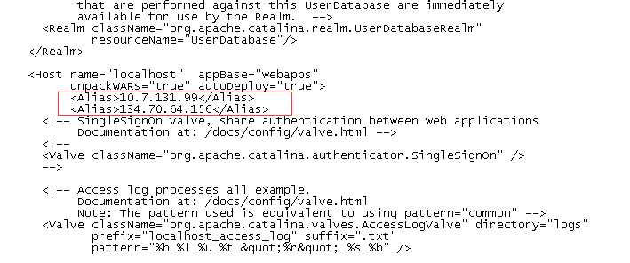

## web安全-中级漏洞

### 1.用户名密码可爆破
web登录界面验证码不主动更新。对登录错误次数没有限制。

分析：登录界面没有动态验证码，登录界面验证码不主动更新，对登录错误次数没有限制。

危害：若存在弱了口令极有可能被攻击者获取到登录系统的权限。

解决方法：

- 登录界面添加动态验证码，并且尝试登录一次后及时更新(用户名或密码错误之后，后端需失效验证码)。
- 登录界面登录一次后及时更新验证码，使之前的验证码失效(需要后端主动失效)。
- 验证码设置过期时间

### 2.用户名可遍历（待验证安全影响）

分析：密码错误与用户不存在的提示信息不同，造成用户名可以遍历。

危害：使攻击者获取到系统的用户名等信息。

解决方法：使用统一的提示信息，提示用户登录失败。
暂时不影响，因为提示都一样了，用户就不知道自己是用户名错了，还是密码错了。

### 3.无需正确的用户名密码可进入系统
可以直接通过url范围页面，未做拦截。

虽然获取不到数据，但是进入系统可以收集更多的信息，进一步攻击。

分析：验证用户身份后，未将页面重定向至登录页面。

危害：使攻击者获取到系统相关的一些信息。

解决方法：当验证用户身份不正确时，重定向至系统登录界面。

例如axios可以配置全局拦截，当后端返回用户无权限状态码时跳转到指定页面。
```js
// axios过滤器， 对未登陆的响应，跳转登陆页面
// ⚠️ 所有的axios请求都会过这里
axios.interceptors.response.use(function (response) {
  // 判断用户是否登陆
  if (response.data.code === 401) {
    location.href = projectConf.loginPage
  }

  return response;
}, function (error) {
  // 对响应错误做点什么
  return Promise.reject(error);
});
```

### 4.Host头攻击

虽然获取不到数据，但是进入系统可以收集更多的信息，进一步攻击。

分析：为了方便的获得网站域名，开发人员一般依赖于HTTP Host header。例如，在php里用_SERVER["HTTP_HOST"]。

危害：这个header是不可信赖的，如果应用程序没有对host header值进行处理，就有可能造成恶意代码的传入。

解决方法：web应用程序应该使用SERVER_NAME而不是host header。
在Apache和Nginx里可以通过设置一个虚拟机来记录所有的非法host header。在Nginx里还可以通过指定一个SERVER_NAME名单，Apache也可以通过指定一个SERVER_NAME名单并开启UseCanonicalName选项。

解决办法一：tomcat配置

只允许指定host请求服务:



### 5.Microsoft Windows MHTML脚本代码注入漏洞（MS11-026）

虽然获取不到数据，但是进入系统可以收集更多的信息，进一步攻击。

分析：在某些情况下，此漏洞可能会允许攻击者在运行在受害者IE中的Web请求的响应中注入客户端脚本。

危害：该脚本可欺骗内容、泄露信息或以目标用户身份在受影响站点进行攻击。

解决方法：服务器端过滤参数中的回车换行。

### 6.CSRF 站点存在跨站请求伪造。

伪造一个连接，诱导用户点击，然后利用cookie验证等，以用户的身份向服务器发送信息。
达到在用户不知情的情况下，进而进行用户不愿做的行为。

使用图片的CSRF攻击常常出现在网络论坛中，因为那里允许用户发布图片而不能使用JavaScript。

分析：未对referer属性进行验证，请求包中没有一个随机的token值。

危害：攻击者盗用了用户的身份，以用户的名义发送恶意请求。

解决方法：请求包中增加一个随机的token值，对referer属性进行验证。
