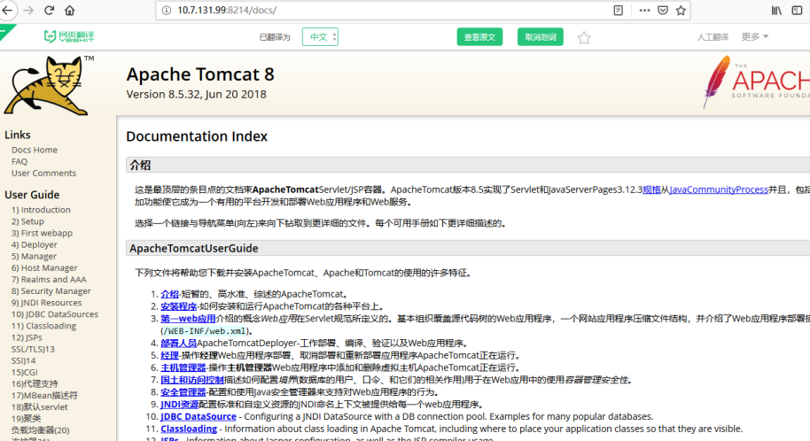

## web安全-低级漏洞

### 1. 启用了不安全的HTTP方法

分析：Web 服务器或应用程序服务器是以不安全的方式配置的。

危害：可能会在Web 服务器上上载、修改或删除Web 页面、脚本和文件。
修复方案: 如果服务器不需要支持WebDAV，请务必禁用它，或禁止不必要的HTTP 方法。

### 2. 点击劫持

该站点可以在<iframe>中显示。

分析：存在点击劫持。

危害：照成信息泄露，等危害。

解决方法：X-FRAME-OPTIONS是微软提出的一个http头，专门用来防御利用iframe嵌套的点击劫持攻击。
这个头有三个值：
DENY // 拒绝任何域加载
SAMEORIGIN // 允许同源域下加载
ALLOW-FROM // 可以定义允许frame加载的页面地址
设置相应的值来进行限制

前端项目可以主动判断iframe进行拦截

```js
// 判断是否是 ifrme 内打开的
isInIframe(){
  return self !== top;
}

// 判断是否同服务下的网站，如果是，直接刷新，不是新开窗口打开
openNoIframe(src, title){
  try {
    if (window.parent.location.href && new RegExp(projectConf.path).test(window.parent.location.href) ) {
      window.parent.location.href = src;
    }
  } catch (e) {
    console.warn( e );
    alert('将在新窗口打开-'+title+'页面\n如果没打开，请更改浏览器的设置，允许打开新窗口')
    window.open( src, title )
  }
}
```

### 3. Tomcat使用说明未关闭造成敏感信息泄露



该站点Tomcat使用说明未关闭造成敏感信息泄露。

分析：未将Tomcat相关页面关闭

危害：使攻击者获取到相应的信息，对系统进一步攻击。

解决方法：限制页面访问。

### 4. 敏感信息泄露


分析：登录成功后，站点将相关用户手机号等信息返回到前端。

危害：若被攻击者获取到信息，可对用户进一步欺骗以及对系统入侵。

解决方法：不将重要的敏感信息返回到前端。
