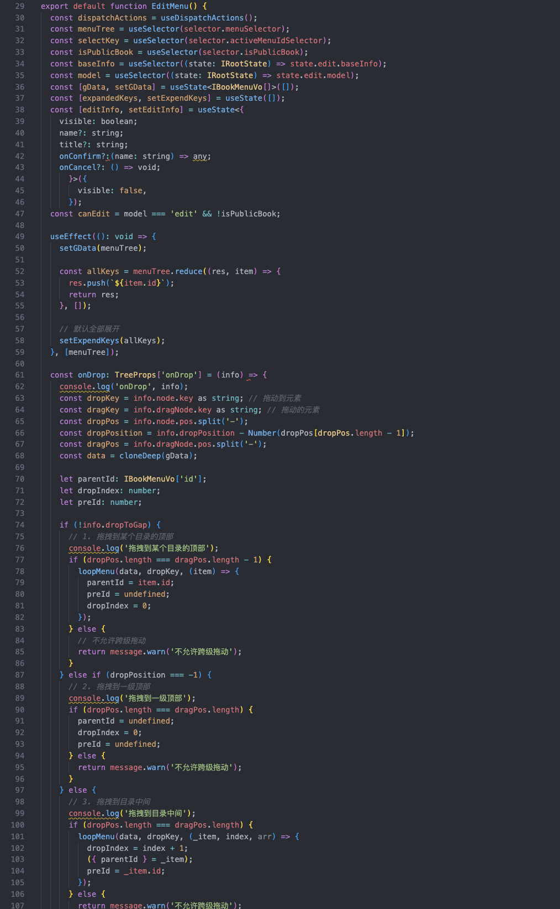
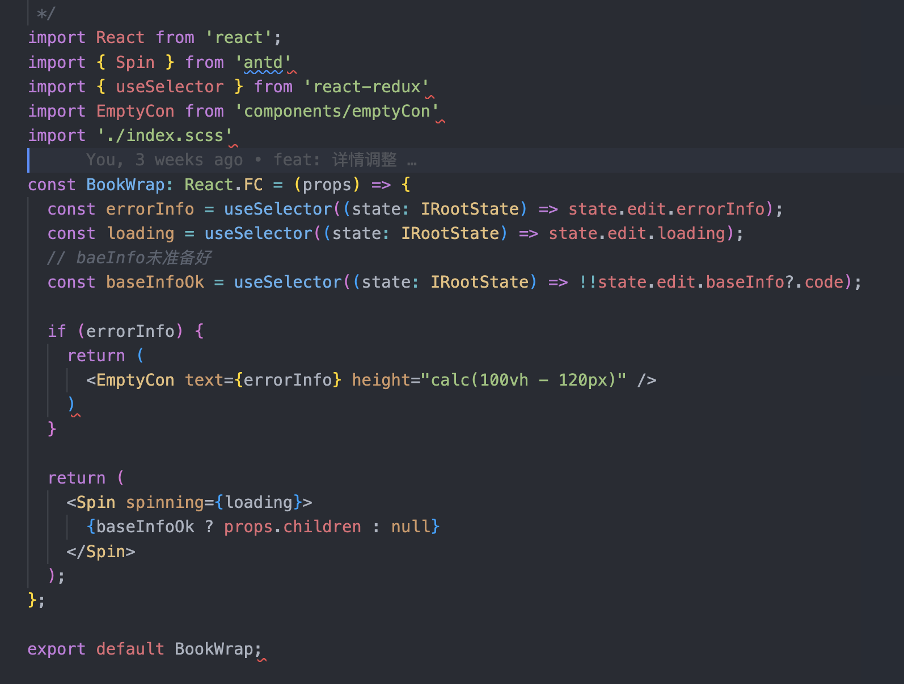
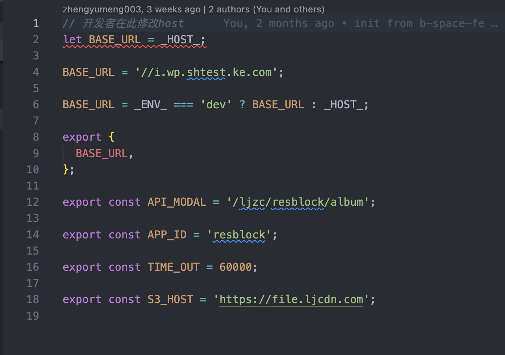
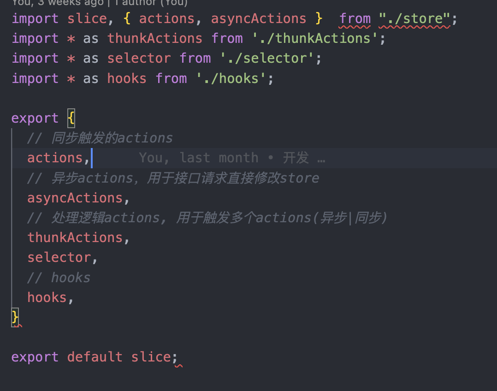
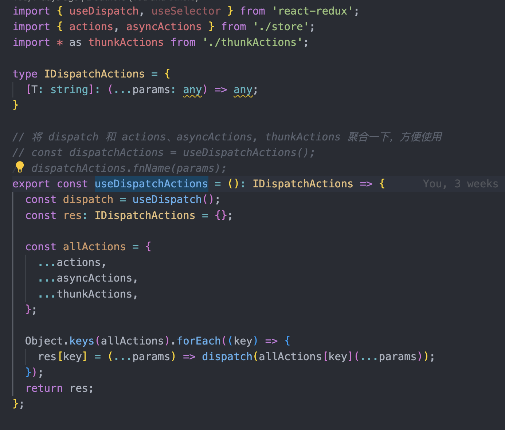

# 模块化

## 1. 什么是模块化

- 将一个复杂的程序依据一定的规则(规范)封装成几个块(文件), 并进行组合在一起。
- 块的内部数据与实现是私有的, 只是向外部暴露一些接口(方法)与外部其它模块通信

>模块是可组合、分解和更换的单元

## 模块化的作用

- 解决命名冲突、代码冗余、依赖关系难以维护等问题
- 提升代码的可维护性

> 一个一千行的文件，和一个一百行的文件，你愿意看哪个？

>比较多的代码


>比较少的代码


## 如何划分

核心: 可复用 易管理

方式:

**功能｜使用场景**

- utils 方法函数
- services 和服务端通信
- pages 页面
- components 公共组件
- routes 路由管理
- constants 静态变量

**提取静态变量**



**统一出口**



**使用 hooks 拆分内部方法**



>其他场景： 分页加载数据，多个组件都会调用的方法，接口等。

## css模块化

### css命名规范

#### BEM

BEM的意思就是块（block）、元素（element）、修饰符（modifier）


```css
.menu{} /* 块-块 */
.menu__title{} /* 元素 */
.menu--active{} /* 修饰符 */
```

```html
<div class="menu menu--active">
  <div class="menu__icon"></div>
  <div class="menu__title"></div>
</div>
```

**优点**

- 避免级联： BEM 的优点在于所产生的 CSS 类名都只使用一个类别选择器，可以避免传统做法中由于多个类别选择器嵌套带来的复杂的属性级联问题。
- 不存在复杂的优先级：所有的 CSS 样式规则都只用一个类别选择器。因此所有样式规则的特异性（specificity）都是相同的，也就不存在复杂的优先级问题。
- 类名的层次关系可以与 DOM 节点的树型结构相对应。

**缺点:**

CSS 类名会比较长而且复杂

#### oocss

Object Oriented CSS，面向对象的CSS，旨在编写高可复用、低耦合和高扩展的CSS代码。

OOCSS 认为 container（容器） 和 content（内容） 是需要隔离开的。也就是说，尽量不要去使用依赖于节点结构位置的样式定义。比如这样的就是不允许的：

按照 OOCSS ，会为这个容器创建更多的类，并且每个样式对应一个类，这样是为了后面可以重复使用这些组件的样式，避免重复写相同的样式。如下：

```html
<div class="sizelof2 solidGray bgYellow mt10 ml25 mr15 mb20"></div>

<style>
.sizelof2{width: 50%};
.solidGray{border: 1px solid #ccc};
.bgYellow {background: yellow};
.mt10 {margin-top: 10px};
.mr15 {margin-right: 15px};
.mb20 {margin-bottom: 20px};
.ml25 {margin-left: 25px};
</style>
```

#### AMCSS

Attribute Modules for CSS 利用属性选择器来模块化css。

```html
<div button="large blue">Button</div>

<style>
[button] {/* ... */}
[button~="large"] {/* ... */}
[button~="blue"] {/* ... */}
</style>
```

#### ACSS

Atomic CSS ，即原子化的 CSS。

单一的样式定义一个 Class，确保整个样式表没有一条重复的样式，这样复用性是最高的，代码也最少，但是每个元素就需要一堆的 Class。

**优点**

- 代码量最小

**缺点**

- 需要定义很多class, html变大
- 而且需要记很多新规则

```html
<div class="w-100 h-150 m-10 bgc-greed f-l"></div>

<style>
.w-100 { width: 100px; }
.h-150 { height: 150px; }
.m-10 { margin: 10px; }
.bgc-greed { background-color: green; }
.f-l { float: left; }
</style>
```

### css Modules

通过类名加上不同的变量，保证独立，解决了 CSS 的全局命名冲突问题。

样式覆盖比较难，一般在组件上不建议使用，可以在业务模块上使用。
