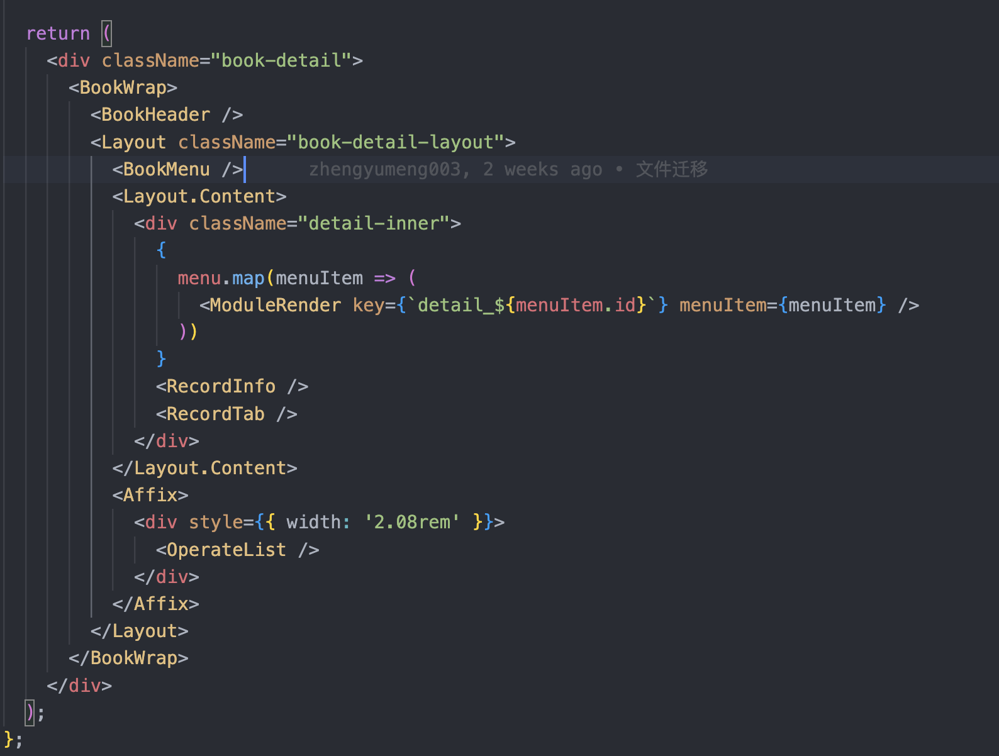
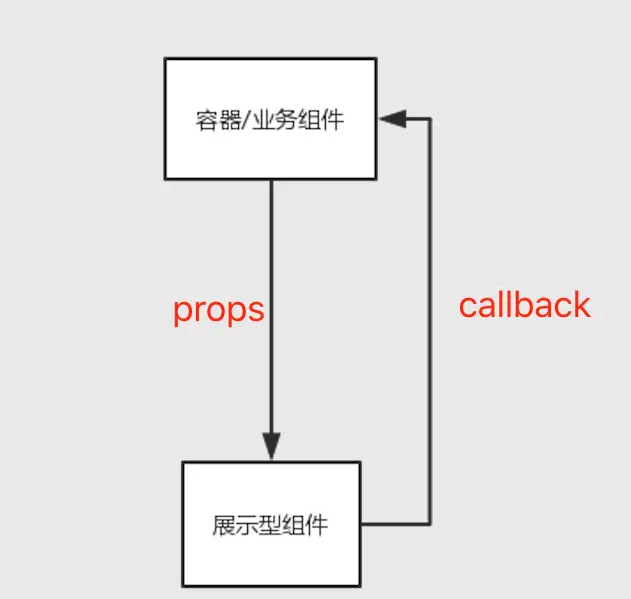
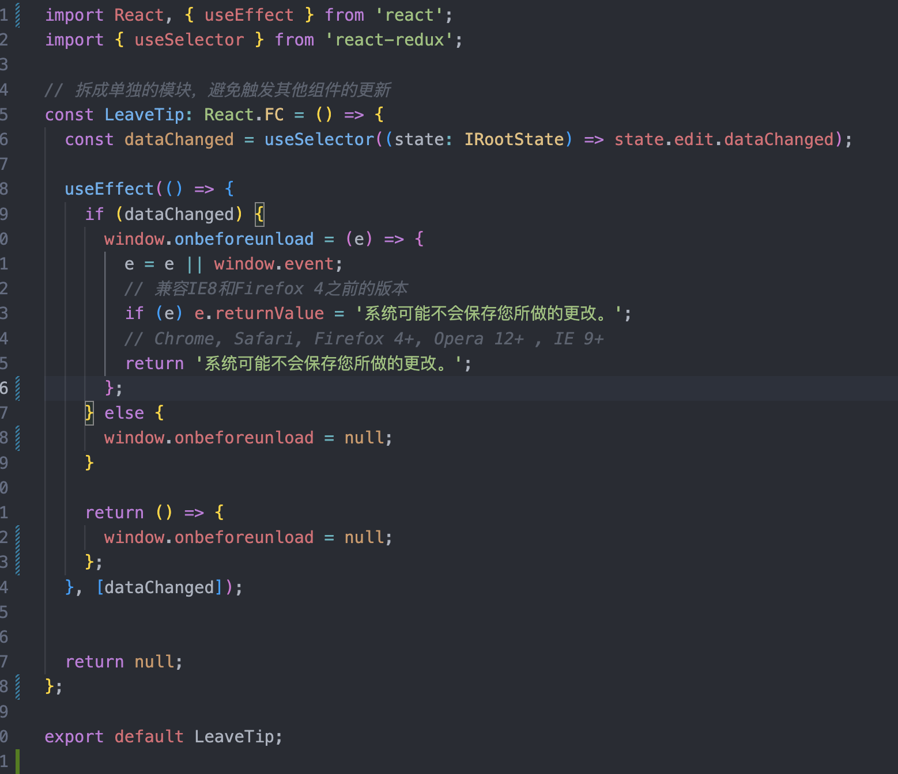
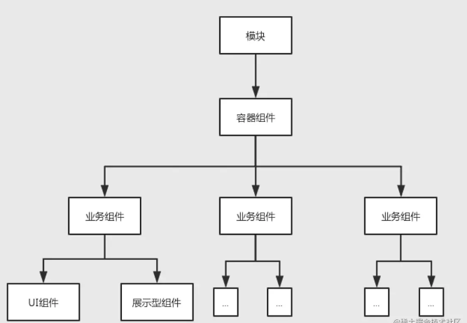
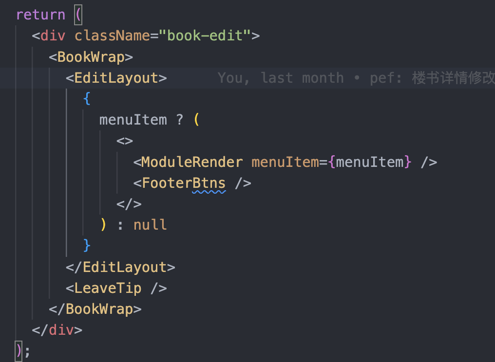

# 组件化

组件化是指解耦复杂系统时将多个功能模块拆分、重组的过程，有多种属性、状态反映其内部特性。

构建管理自身状态的封装组件，然后对其组合以构成复杂的 UI。

组件化，就像乐高一样，通过不同的零件，组装成一个大的功能。

## 有模块化了，为什么又需要组件化

- 模块化是一种分治的思想，诉求是解耦，一般指的是js模块，比如用来格式化时间的模块
- 组件化是模块化思想的实现手段，诉求是复用，包含了template，style，script，script又可以由各种模块组成

- 模块一般是项目范围内按照项目业务内容来划分的，比如一个项目划分为子系统、模块、子模块，代码分开就是模块
- 组件是按照一些小功能的通用性和可复用性抽象出来的，可以跨项目，是可复用的模块

## 分类

### 容器组件

- 一个容器性质的组件，一般当作一个业务子模块的入口。
- 集中/统一的状态管理，向其他展示型/容器型组件提供数据（充当数据源）和行为逻辑处理（接收回调）
- 如果使用了全局状态管理，那么容器内部的业务组件可以自行调用全局状态处理业务
- 业务模块内子组件的通信等统筹处理，充当子级组件通信的状态中转站
- 模版基本都是子级组件的集合，很少包含DOM标签

一般页面的入口都是一个容器组件。

### 基础组件

- 为了让开发者更关注业务逻辑，能满足大部分的场景。
- 和业务逻辑分离，提升组件的跨项目通用性。
- 可以是容器组件也可以是展示组件

组件库如antd，element-ui等，都是提供基础组件。

### 展示组件 纯UI展示

展示组件倾向于无状态，通过props参数的传递，由父组件控制组件的状态。

例如: 空白页状态，图表组件，卡片样式，布局组件等。

### 业务组件

- 为了实现某一业务功能而实现，
- 组件内部和业务关联起来，
- 可以和服务器通信，和store通信。
- 一般有自己的状态管理
- 业务组件也具有一定的复用性，有些是一次性组件

### 逻辑组件

不包含UI层的某个功能的逻辑集合

## 组件化的利弊

### 利

- 更好的关注分离，可以更好的理解应用。
- 复用性高，一个组件只做一件事，解除了组件的耦合带来更高复用性
- 修改ui而不用改变app的逻辑
- 提高健壮性，通过组件参数(props)的校验机制，防止出错
- 可测试性，组件化使得，单独测试一个业务功能变得更加方便
  - 组件做的事情更少了，测试也会变得容易
  - 容器组件不用关心UI的展示，只关心数据和更新
  - 展示组件只是呈现传入的props，写单元测试的时候也非常容易mock数据层

### 弊

- 组件需要很好的管理，胡乱划分会使得组件难以管理
- 过度的组件设计，使得组件之间通信困难（例如组件层级太多）

## 组件协同组成业务模块

## 案例拆解

1. 楼书编辑

BookWrap: 异常状态管理，空页面，错误信息，加载状态
EditLayout: 整体布局 header, menu, content
FooterBtns: 底部按钮
LeaveTip: 页面离开提示

1. 楼书编辑到详情。只需要增删需要的组件即可。

