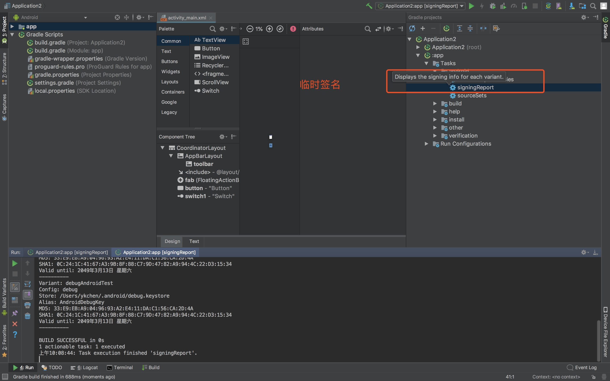

## 1. 下载地址

https://www.androiddevtools.cn/
>注意， 下载正式版 不要从别的平台下载，可能会有病毒

## 2. 创建项目

[创建项目](https://www.runoob.com/w3cnote/android-tutorial-android-studio.html)

## 3. 项目设置
1. 自带默认签名文件位置


2. debug包位置


3. 新增模块
  无

4. 删除模块
  1. 打开`Modules Settings `
    
  2. 删除模块
    
  3. 回到目录 > 右键 > 删除文件
    

5. 签名打包

  签名后的包可以直接安装

  1. 签名
  
  2. 新增签名
  
  3. 打包
  
  4. 打包目录位置
  

6. 配置gradle方式打包
见 [gradle生成apk](./gradle生成apk.docx) 文件


## 4. 安卓连接模拟器
模拟器可以选择【夜神模拟器】或者【木木模拟器】

- 夜神模拟器，

 命令行运行以下命令
```
adb connect  127.0.0.1:62001
```

- mumu模拟器

  命令行运行以下命令

  首先关闭服务
  ```
  adb kill-server
  ```
  再启动服务
  ```
  adb start-server
  ```

## 5. 模拟器运行项目

1. 点击运行按钮

2. 选择模拟器

3. 等待程序运行，打开模拟器，可以看到安装的APP

