# 用ReactNative搭建一个安卓APP

读者须知：本文面向有稍微有基础的前后端开发者，阅读之前需要保证你有【基础的命令行知识】【基础前端知识】。如果你只是想了解大概流程，也可以看下。
目标：window上搭建android应用
依据： 本文主要参考根据react native官方文档，来配置搭建环境。

## 1. 搭建开发环境
[参考官方文档](https://reactnative.cn/docs/0.51/getting-started.html#content)
安装所有的必需软件
模拟器装的[夜神模拟器](https://www.yeshen.com/)，没有用官方的。
注意【将Android SDK的Tools目录添加到PATH变量中】这个步骤一定要做。
所有东西安装完成后，先不要执行【测试安装】步骤，往下看。

### 搭建环境遇到的问题（没问题可跳过）
1. 安装完成android studio后看下SDK的安装目录有没有`platform-tools`文件夹，如果没有，说明这个并没有安装成功，其他插件同理。

解决办法：
有些插件国内下载不了，可以配置http代理。
修改Android SDK manager界面中`tools>options`然后修改成这样`HTTP Proxy ：mirrors.neusoft.edu.cn` 和` HTTP Proxy Port:80`
注意：地址可能会失效，可以百度一个新的试试
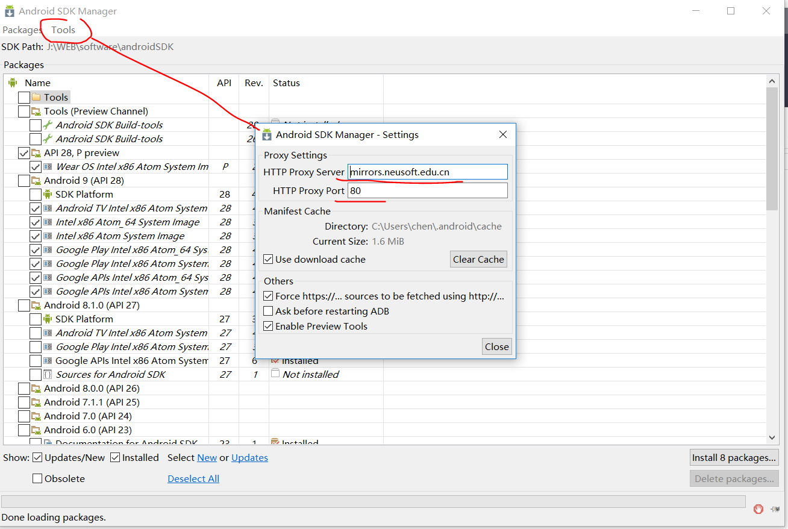

## 2. 搭建好环境之后(adb需要可用)配置模拟器。
### 2.1 解决 SDK的adb版本和夜神的adb版本不一样

1、先关闭所有adb的进程； 
2、将电脑中SDK目录下的adb.exe文件，复制到夜神模拟器的目录下(bin目录)，改名为nox_adb.exe（夜神模拟器目录下的adb文件名字叫做nox_adb.exe）。 
3、重启模拟器

### 2.2 配置打开夜神模拟器USB调试模式
打开夜神模拟器： 

设置>关于平板电脑>版本号。 一直点直到出现提示进入开发者模式。
返回设置就会出现【开发者选项】
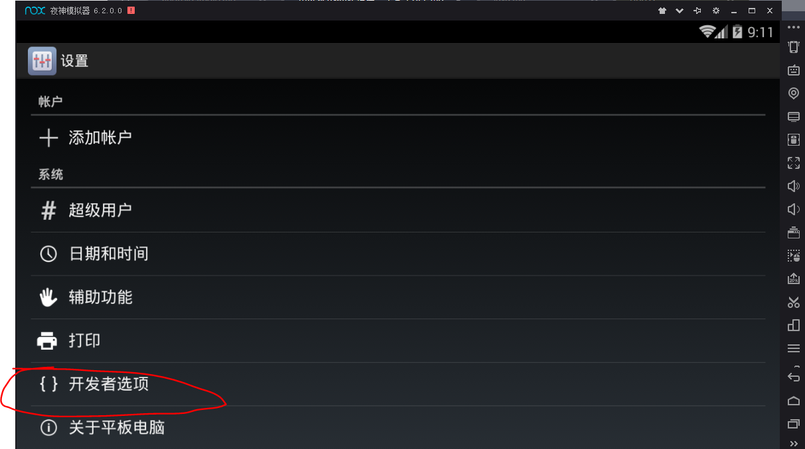

打开USB调试
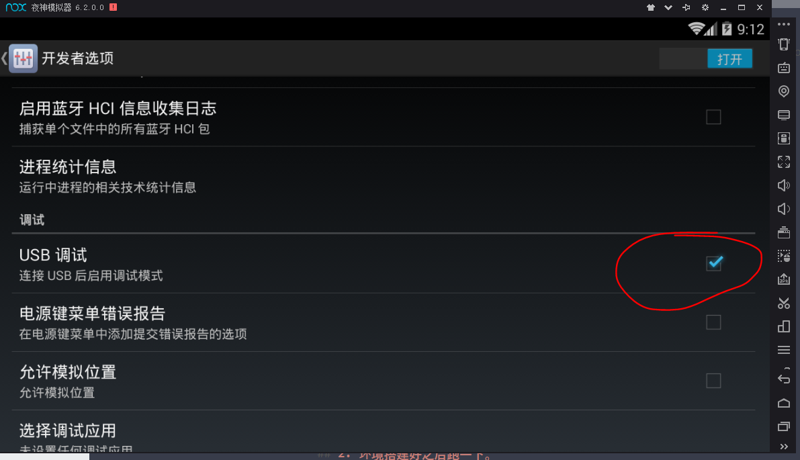

### 3.测试是否可以检测到模拟器

    $ adb devices
    List of devices attached
    127.0.0.1:62001 device

如果显示以下信息说明检测到了夜神模拟器，没有说明没有检测到，看看上面的哪一步做错了。

## 2. 测试安装。

### 1. 初始化react-native项目

    react-native init AwesomeProject
    cd AwesomeProject
    react-native run-android

`react-native init AwesomeProject`之后会生成一个新的目录

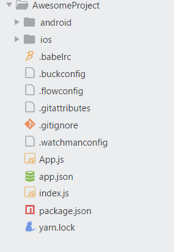

`react-native run-android`之后会新打开一个命令行窗口，为packager服务

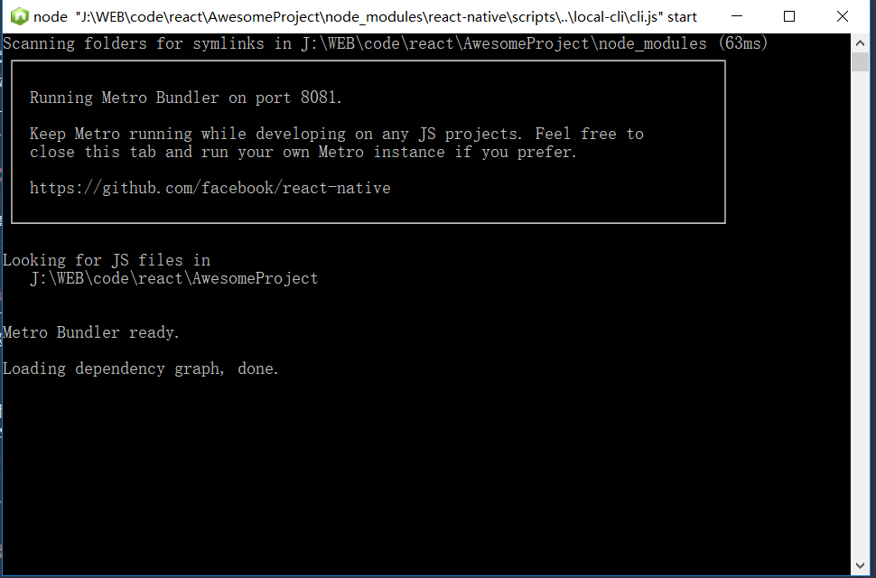

夜深模拟器会有一个APP
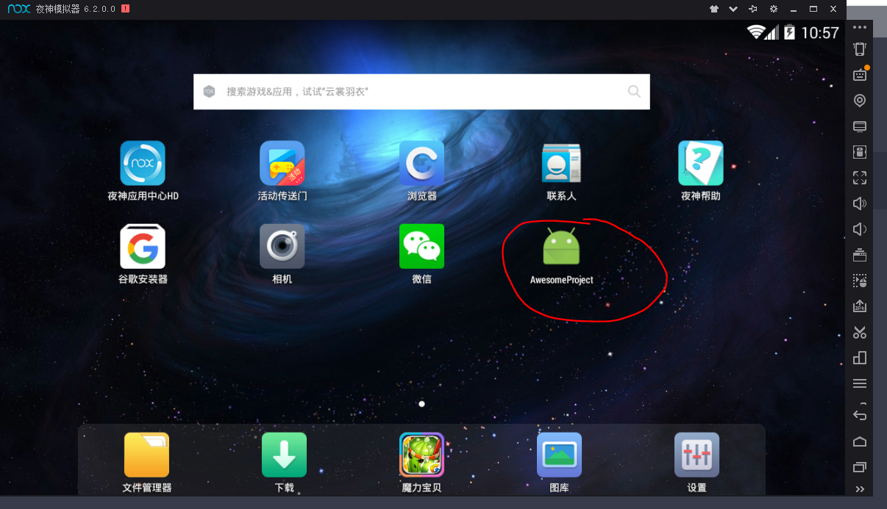

打开APP之后会有一个红屏页面，因为还没配置访问pc端的packager服务。
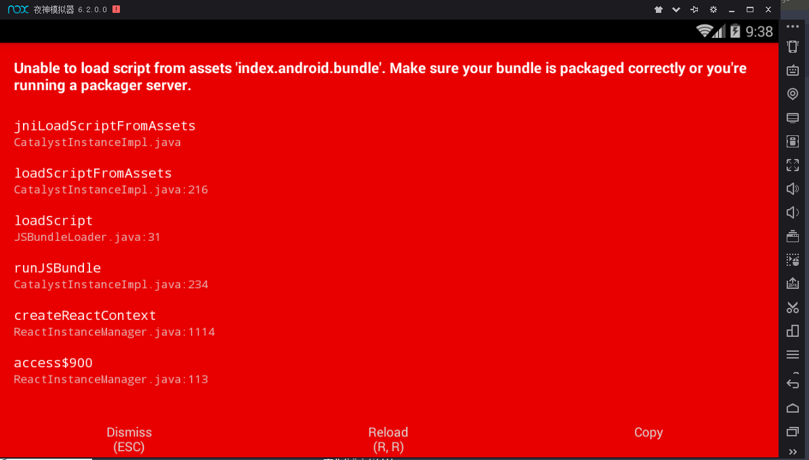

点击右上角的震动按钮打开调试窗口
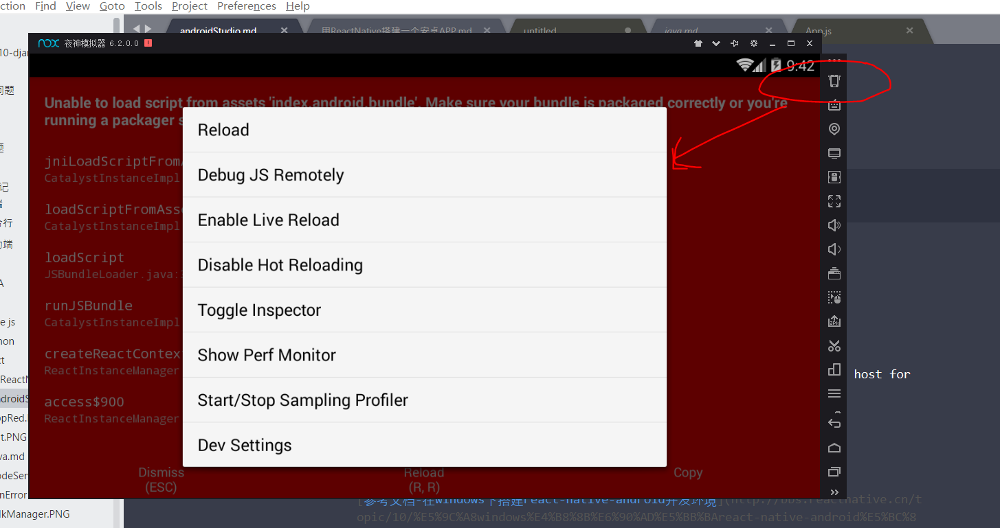

点击`Dev settings` 进去之后点击 `Debug server host & port for device`配置端口
输入本机的局域网IP加:8081
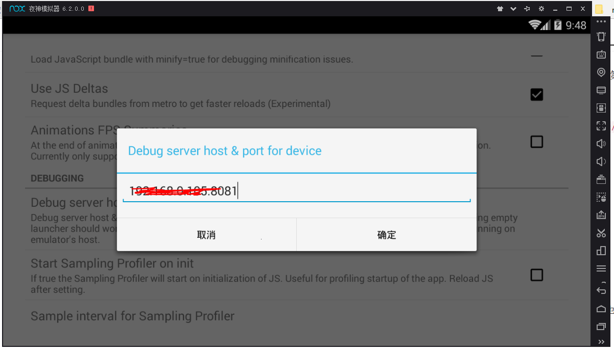

确定之后返回重启APP
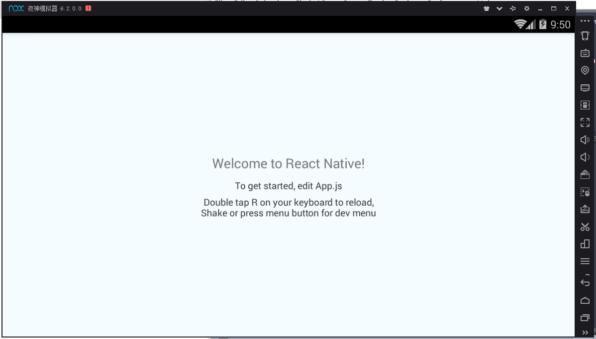

[参考文档-在windows下搭建react-native-android开发环境](http://bbs.reactnative.cn/topic/10/%E5%9C%A8windows%E4%B8%8B%E6%90%AD%E5%BB%BAreact-native-android%E5%BC%80%E5%8F%91%E7%8E%AF%E5%A2%83/2)

## 3. 打包成APK文件

[参考官方文档](https://reactnative.cn/docs/0.51/signed-apk-android.html#content)
按照文档一直做就可以了。

注意以下两点：
1. my-release-key.keystore密钥库文件在执行命令的当前目录
2. 添加签名到项目的gradle配置文件时不要漏了`signingConfig signingConfigs.release`。
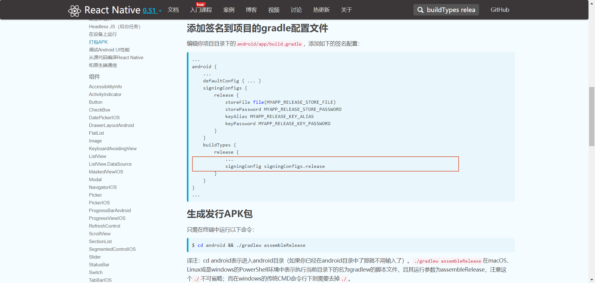

