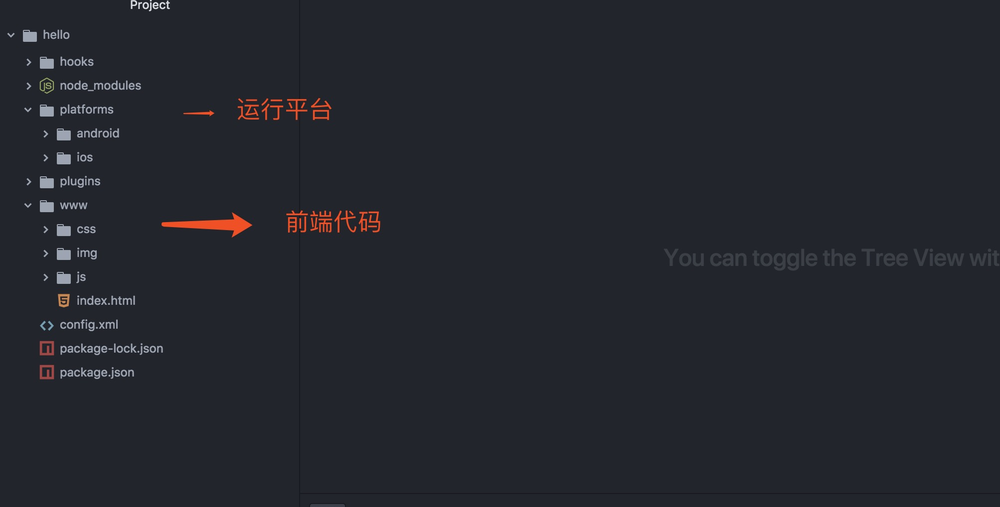
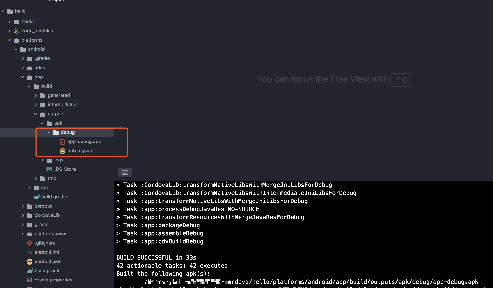
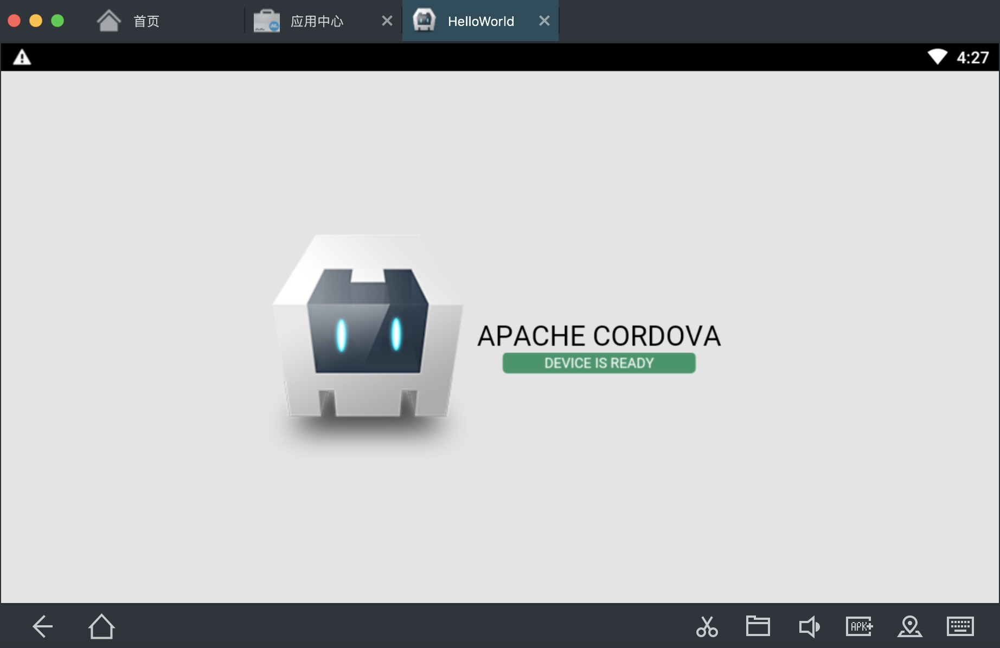
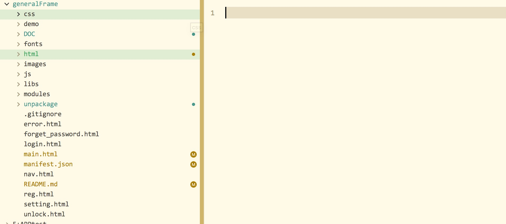
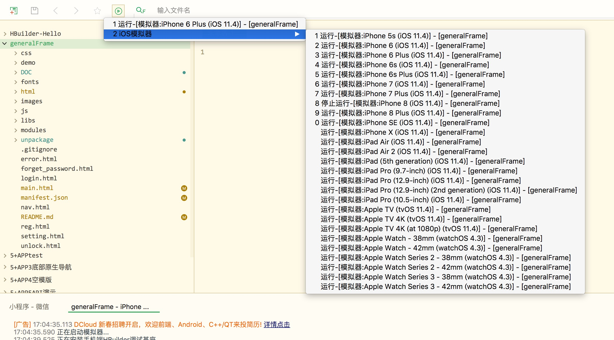
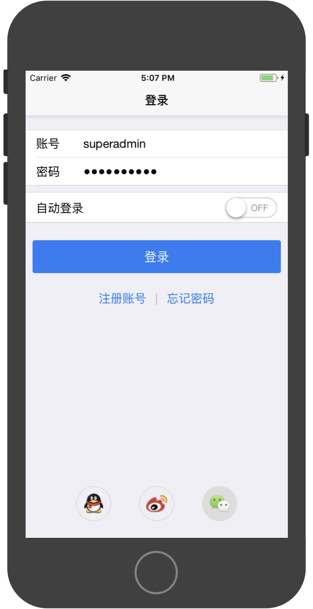

## 目前几种APP开发方式
1. 利用webview的混合开发
  1. dcloud 5+APP
  2. Apache Cordova
2. 将js编译成原生代码执行
  1. React Native
  2. Weex
  3. uni-app 需要用到小程序，编译之后运行

## 交互原理

### webview模式JS和原生交互原理
#### 1. js brage

引用其他文章的一段话
[引用原文地址](https://blog.csdn.net/duwen90/article/details/79389545)
>由于H5页面是内嵌到原生应用的WebView组件（一个浏览器内核）中，而手机浏览器Javascript引擎是在一个沙箱环境中运行，因此JavaScript的权限受到严格限制，比如没有本地文件读写权限、不能使用GPS、不能修改系统配置等。所以，如果JavaScript要用到这些受限的能力时，就需要委托原生去实现，原生完成后，再将结果通知JavaScript，因此，JavaScript和原生之间就需要一个通信的桥梁，而这个桥梁本质上就是原生的浏览器组件（我们统一称之为WebView）与Javascript 通信的通道，一般称为 WebView JavaScript Bridge, 为了简单，一般简称为 JS bridge

1. 原生可以向webview注入JS代码，注入已经定义好的JS代码。
2. JS调用注入的API吊起原生方法。
3. 原生可以通过webview执行JS的方法。调用回掉方法通知前端。


## 1. Apache Cordova
Apache Cordova是一个开源移动开发框架。它允许您使用标准Web技术 - HTML5，CSS3和JavaScript进行跨平台开发。应用程序在针对每个平台的包装器内执行，并依赖符合标准的API绑定来访问每个设备的功能，如传感器，数据，网络状态等。

采用的webview方式

前身是PhoneGap

优点
- 基本是命令行运行
- 可以命令行打包
- 可以和原生混合开发

缺点
- 每个平台环境需要单独配置
- 采用的webview方式，性能有局限

项目界面


打包界面


运行结果


### 可以运行生成的平台

包含了所有平台
```
android 8.0.0
ios 5.0.0
browser ^6.0.0
electron ^1.0.0
osx ^5.0.0
windows ^7.0.0
```

## 2. react native

React Native产出的并不是“网页应用”， 或者说“HTML5应用”，又或者“混合应用”。 最终产品是一个真正的移动应用，从使用感受上和用Objective-C或Java编写的应用相比几乎是无法区分的。 React Native所使用的基础UI组件和原生应用完全一致。 你要做的就是把这些基础组件使用JavaScript和React的方式组合起来。

优点
- 可以和原生代码混合开发
- 生态圈完善
- 可以命令行打包、发行
- 性能好

缺点
- 环境配置麻烦
- APP打包需要单独配置

[用ReactNative搭建一个安卓APP](../reactNative/用ReactNative搭建一个安卓APP.md)

## 3. Weex

和react native类似

优点
- 可以和原生代码混合开发
- 性能好

缺点
- 环境配置麻烦
- 打包需要用的android studio(windows)和xcode(mac)
- 生态还不丰富

## 4. dcloud 5+APP

HTML5 Plus移动App，简称5+App，是一种基于HTML、JS、CSS编写的运行于手机端的App，这种App可以通过扩展的JS API任意调用手机的原生能力，实现与原生App同样强大的功能和性能。

使用起来相对简单，对于一些要求不高的APP，可以采用这种模式

优点
- 使用hbuild开发，傻瓜式运行
- 可以云打包
- 环境依赖少
- 可以和原生混合开发
- 可以直接升级资源

缺点
- 文档写的烂
- webview模式，性能有局限

项目结构


运行到模拟器


模拟器运行结果


## 5. uni-app
uni-app 是一个使用 Vue.js 开发跨平台应用的前端框架，开发者编写一套代码，可编译到iOS、Android、H5、小程序等多个平台。

优点:
- 可以使用 es6
- node编译 可以用直接用npm
- 可以打包资源和原生混合开发

缺点
- 需要会小程序
