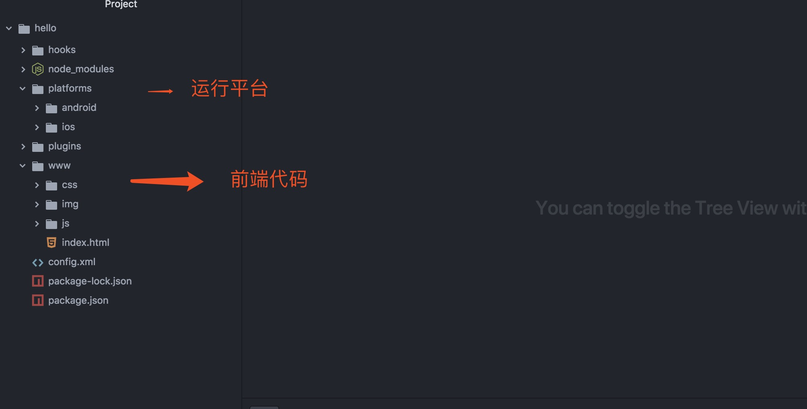
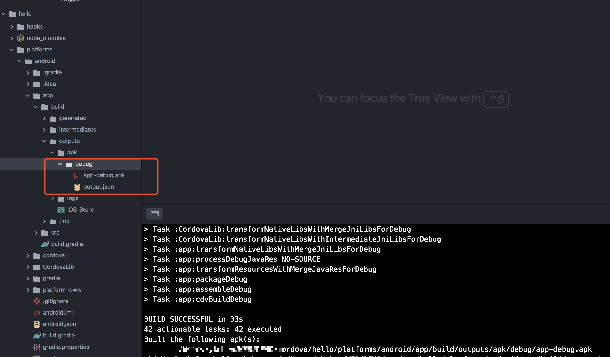
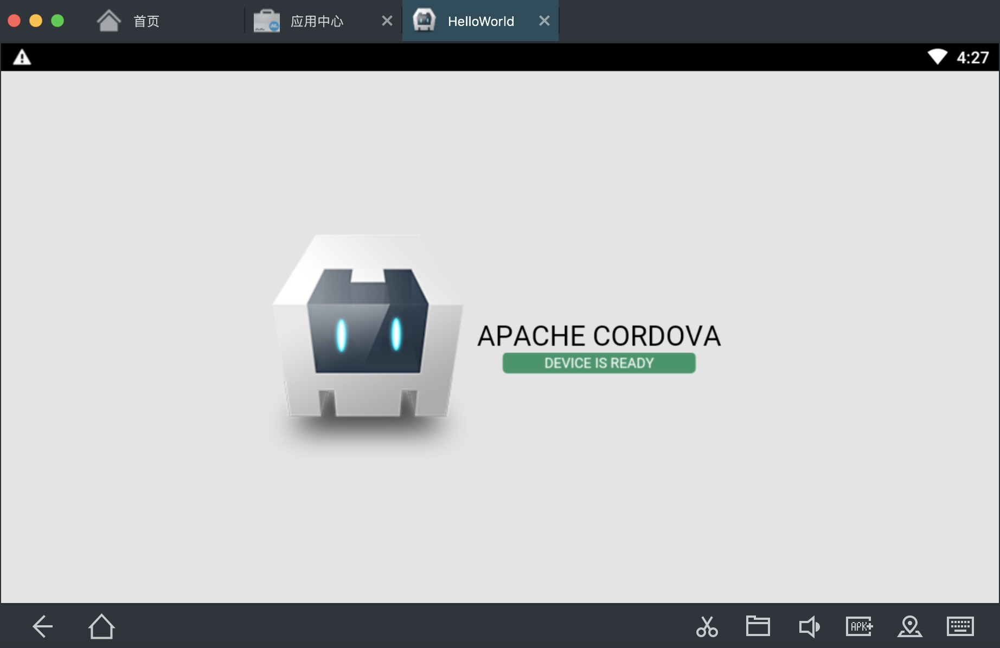

## 目前几种APP开发方式
1. 利用webview的混合开发
  1. hbuild 5+
  2. uni-app ?????
  3. Apache Cordova
2. 将js编译成原生代码执行
  1. React Native
  2. Weex

## JS和原生交互原理
1. 原生可以向webview注入JS代码，注入已经定义好的JS代码。
2. JS调用注入的API吊起原生方法。
3. 原生可以通过webview执行JS的方法。调用回掉方法通知前端。


## 1. cordova
Apache Cordova是一个开源移动开发框架。它允许您使用标准Web技术 - HTML5，CSS3和JavaScript进行跨平台开发。应用程序在针对每个平台的包装器内执行，并依赖符合标准的API绑定来访问每个设备的功能，如传感器，数据，网络状态等。

前身是PhoneGap

基本是命令行运行

每个平台都需要配置些单独的东西

项目界面


打包界面


运行结果


### 可以运行生成的平台

包含了所有平台
```
android 8.0.0
ios 5.0.0
browser ^6.0.0
electron ^1.0.0
osx ^5.0.0
windows ^7.0.0
```

3. react native

React Native产出的并不是“网页应用”， 或者说“HTML5应用”，又或者“混合应用”。 最终产品是一个真正的移动应用，从使用感受上和用Objective-C或Java编写的应用相比几乎是无法区分的。 React Native所使用的基础UI组件和原生应用完全一致。 你要做的就是把这些基础组件使用JavaScript和React的方式组合起来。

可以和原生代码混合开发。

[用ReactNative搭建一个安卓APP](../reactNative/用ReactNative搭建一个安卓APP.md)

3. hbuild5+

4. 5+
