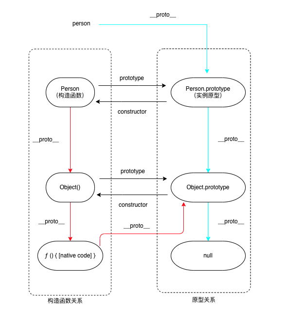
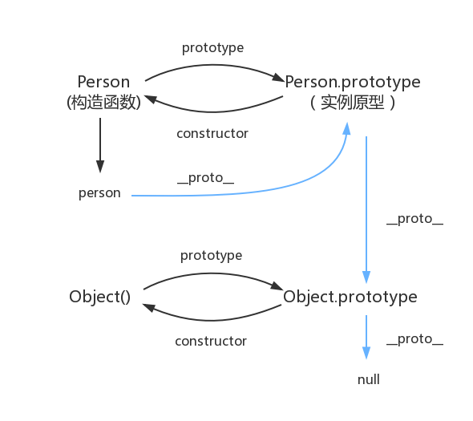

# prototype 和 constructor 的关系

> 参考： <https://github.com/mqyqingfeng/Blog/issues/2>

先创建一个类 People, 和一个它的实例 People

```javascript
class Person {
}

// 子函数，继承People
class Student extends People {

}

const person = new People()
const student = new Student()
```

## 先说关系

```javascript
// Student作为构造函数，有其自己的原型
Student.prototype = {constructor: class Student}
// Student的原型的constructor指向它的构造函数Student
Student.prototype.constructor = Student
// 原型之间相互关联，形成原型链
Student.prototype.__proto__ = People.prototype
// Student继承自person，是有People创建而来，所以他的原型是People函数
Student.__proto__ = People

// student是由Student创建的，__proto__指向Student的原型
student.__proto__ = Student.prototype
// 没有prototype属性
student.prototype = undefined
```

如图：



## 1. prototype是什么？

函数的 prototype 属性指向了一个对象，这个对象正是调用该构造函数而创建的实例的原型。

## 2. 原型是什么？

函数的 prototype 属性指向了一个对象，这个对象正是调用该构造函数而创建的实例的原型。

每一个JavaScript对象(null除外)在创建的时候就会与之关联另一个对象，这个对象就是我们所说的原型，每一个对象都会从原型"继承"属性。

所以原型有哪些属性:

1. 函数的原型属性
2. constructor 指向原型的构造函数

> 注意，函数的实例属性(由函数调用创建而来)，需要在实例上才有

怎么访问原型:
函数通过 prototype 属性
对象通过 __proto__ 属性

## 3. constructor 是什么？

constructor是原型的一个属性，指向构造函数。
至此: 构造函数和原型相互关联起来。
People.prototype === 原型
原型.constructor === People

## 4. `__proto__`

这是每一个JavaScript对象(除了 null )都具有的一个属性，叫__proto__，这个属性会指向该对象的原型。
而实例 person.__proto__ === People.prototype。

一般情况下函数的原型是函数，对象的原型是对象。
Student.__proto__ === People
student2.__proto__ === Student.prototype

但是有个例外, Function原型的原型是个对象。
Function.prototype.__proto__ === Object.prototype

> tips:
> 1.绝大部分浏览器都支持这个非标准的方法访问原型，然而它并不存在于 Person.prototype 中，实际上，它是来自于 Object.prototype ，与其说是一个属性，不如说是一个 getter/setter，当使用 obj.__proto__ 时，可以理解成返回了 Object.getPrototypeOf(obj)。 </br>
> 2.函数或者class也是一个对象，也有__proto__属性，指向函数的原型，People.__proto__ === Function.prototype </br>
> Function.__proto__ === Function.prototype </br>

## 原型链

相互关联的原型组成的链状结构就是原型链，也就是蓝色的这条线



## 继承

继承意味着复制操作，然而 JavaScript 默认并不会复制对象的属性，相反，JavaScript 只是在两个对象之间创建一个关联，这样，一个对象就可以通过委托访问另一个对象的属性和函数，所以与其叫继承，委托的说法反而更准确些。

## 实现一下class的继承

```javascript
// 1. 保留自己的原型属性
// 2. 实现对SupClass 原型属性的继承
// 3. 保留自己的构造函数
function extend(SubClass, SupClass) {

  const sup = Object.create(SupClass.prototype)

  // 保留自己的原型属性
  Object.keys(SubClass.prototype).forEach(key => {
    sup[key] = SubClass.prototype[key]
  })

  // 实现对SupClass 原型属性的继承
  SubClass.prototype = sup
  // 保留自己的构造函数
  sup.constructor = SubClass

  SubClass.__proto__ = SupClass

  // 提供一个super函数，在子类中可以调用，实现对父类实例属性的定制
  // this需要指向子函数
  // sup.super = function (props) {
  //   SupClass.call(this, props)
  // }

  return SubClass
}
```
