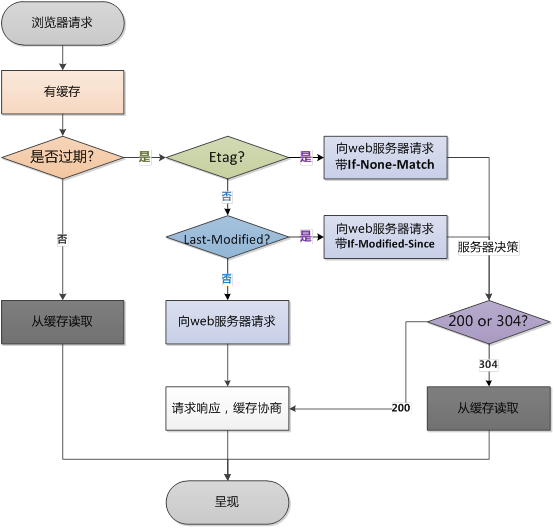

## http缓存

HTTP的缓存属于客户端缓存

上个图

>图片引用自(https://www.cnblogs.com/ranyonsue/p/8918908.html)

- 强缓存浏览器返回状态码200
- 协商缓存状态吗304

关闭缓存:

Catch-Control: no-store;

### 缓存的规则

强制缓存的优先级高于协商缓存

#### 强制缓存

当缓存数据库中已有所请求的数据时。客户端直接从缓存数据库中获取数据。当缓存数据库中没有所请求的数据时，客户端的才会从服务端获取数据。响应信息都是200。

服务器响应的header中会用两个字段来表明——Expires(过期时间)和Cache-Control。

Exprires的值为服务端返回的数据到期时间。但由于服务端时间和客户端时间可能有误差，这也将导致缓存命中的误差。目前多用Cache-Control

Cache-Control
  - private：客户端可以缓存
  - public：客户端和代理服务器都可以缓存
  - max-age=t：缓存内容将在t秒后失效（会自动设置Exprires过期时间）
  - no-cache：需要使用协商缓存来验证缓存数据
  - no-store：所有内容都不会缓存

#### 协商缓存

又称对比缓存，客户端会先从缓存数据库中获取到一个缓存数据的标识，得到标识后请求服务端验证是否失效（新鲜），如果没有失效服务端会返回304，此时客户端直接从缓存中获取所请求的数据，如果标识失效，服务端会返回更新后的数据。

**Last-Modified**

Last-Modified： 服务器在响应请求时，会告诉浏览器资源的最后修改时间。

if-Modified-Since:

浏览器再次请求服务器的时候，请求头会包含此字段，后面跟着在缓存中获得的最后修改时间。服务端收到此请求头发现有if-Modified-Since，则与被请求资源的最后修改时间进行对比，如果一致则返回304和响应报文头，浏览器只需要从缓存中获取信息即可。
从字面上看，就是说：从某个时间节点算起，是否文件被修改了

  - 如果真的被修改：那么开始传输响应一个整体，服务器返回：200 OK
  - 如果没有被修改：那么只需传输响应header，服务器返回：304 Not Modified

**Etag**

  Etag： 服务器响应请求时，通过此字段告诉浏览器当前资源在服务器生成的唯一标识（生成规则由服务器决定）

  If-None-Match: 浏览器再次请求服务器的时候，请求头会包含此字段。如果和服务器Etag匹配则缓存生效。

### 缓存的优点
  - 减少了冗余的数据传递，节省宽带流量
  - 减少了服务器的负担，大大提高了网站性能
  - 加快了客户端加载网页的速度 这也正是HTTP缓存属于客户端缓存的原因。

### 不同刷新的请求执行过程
1. 浏览器地址栏中写入URL，回车

  浏览器发现缓存中有这个文件了，不用继续请求了，直接去缓存拿。（最快）

2. F5

  F5就是告诉浏览器，去服务器看看这个文件是否有过期了。于是浏览器就会发送一个请求带上If-Modify-since。

3. Ctrl+F5

  告诉浏览器，你先把你缓存中的这个文件给我删了，然后再去服务器请求个完整的资源文件下来。于是客户端就完成了强行更新的操作.

### Cache-Control

缓存请求指令:

```
Cache-Control: max-age=<seconds>
Cache-Control: max-stale[=<seconds>]
Cache-Control: min-fresh=<seconds>
Cache-control: no-cache
Cache-control: no-store
Cache-control: no-transform
Cache-control: only-if-cached
```

缓存响应指令:

```
Cache-control: must-revalidate
Cache-control: no-cache
Cache-control: no-store
Cache-control: no-transform
Cache-control: public
Cache-control: private
Cache-control: proxy-revalidate
Cache-Control: max-age=<seconds>
Cache-control: s-maxage=<seconds>
```